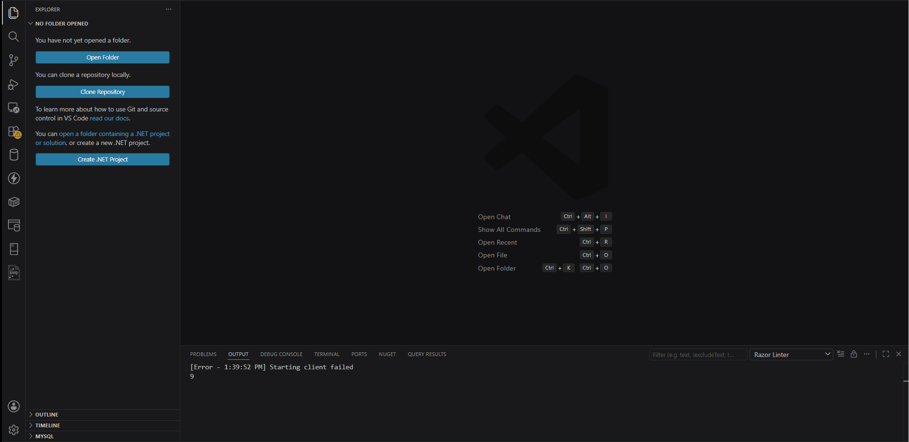

# gitkeep-creator

Add and remove .gitkeep files in empty folders easily from a visual panel inside VS Code.

## Features

- Generate .gitkeep files automatically in empty directories

- Remove existing .gitkeep files recursively

- Visual folder tree preview

- Respects .gitignore rules (basic support)

- Simple UI directly in the Activity Bar

> Tip: This extension is especially useful for keeping empty folders tracked in Git repositories.

## How to Use

1. Open the Gitkeep panel from the Activity Bar

2. Click ... to select a folder

3. Click:

- ➕ Add → to create .gitkeep files in empty folders

- 🗑️ Delete → to remove existing .gitkeep files

4. View the folder structure in the tree preview

## Requirements

No additional dependencies required.

- VS Code version: 1.80.0 or higher

## Extension Settings

This extension does not add custom settings (yet).

## Known Issues

- `.gitignore` support is basic:

- - Only exact folder/file names are supported

- - Patterns like \*.log or dist/\*\* are not fully handled

- Large directory trees may take a moment to render

## Release Notes

Users appreciate release notes as you update your extension.

### 0.0.1

- Initial release

- Add .gitkeep files to empty folders

- Remove .gitkeep files

- Tree view preview

- Basic .gitignore support

---
